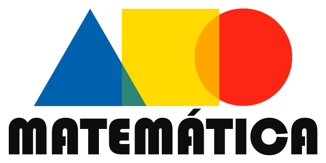

  

<h1 align="center">Website sobre matemática</h1> 

Site sobre conceitos e questões da matemática

Tabela de conteúdos
=================
<!--ts-->
   * [Sobre](#Sobre)
   * [Tabela de Conteudo](#tabela-de-conteudo)
   * [Instalação](#instalacao)
   * [Como usar](#como-usar)
      * [Pre Requisitos](#pre-requisitos)
      * [Local files](#local-files)
      * [Remote files](#remote-files)
      * [Multiple files](#multiple-files)
      * [Combo](#combo)
   * [Tests](#testes)
   * [Tecnologias](#tecnologias)
<!--te-->

<h4 align="center"> 
	🚧  Em desenvolvimento.  🚧
</h4>

## Sobre

 É um projeto de website sobre matematica basica feito com o objetivo de treinar a matematica e resolver questoes sobre a mesma 

## Tabela de conteudo

- [x] Cadastro de usuário
- [x] Cadastro de cliente
- [ ] Cadastro de produtos

## Como usar